<a name="Title"></a>
# Getting started with App Center #

<a name="Overview"></a>
## Overview ##

App Center enables you to ship higher-quality apps faster and with more confidence. Automate the lifecycle of your iOS, Android, Windows, and macOS apps. Connect your repo and within minutes build in the cloud, test on thousands of real devices, distribute to beta testers and app stores, and monitor real-world usage with crash and analytics data. All in one place.

In this lab you will create and manage an App Center app based on an existing Xamarin mobile project. Along with Xamarin, App Center also supports the native Java, Obj-C, and Swift platforms as well as React Native and Cordova. If you have an app written in one of these languages you can still follow this lab, and the steps will be similar.

<a name="Objectives"></a>
## Objectives ##

- Creating an App Center account

- Importing a GitHub repo into a new App Center app

- Integrating App Center into the Xamarin mobile app

<a name="Prerequisites"></a>
## Prerequisites ##

- Visual Studio 2017 from [https://www.visualstudio.com](https://www.visualstudio.com/)

- Mobile development for .NET workflow installed (via **Visual Studio Installer**)

- GitHub Extension for Visual Studio installed (via **Tools | Extensions and Updates**)

- A GitHub account from [https://github.com](https://github.com/)

<a name="Intended Audience"></a>
## Intended Audience ##

This lab is intended for developers who are familiar with C#, although deep experience is not required.

<a name="Exercise1"></a>
## Exercise 1: Getting started with App Center ##

<a name="Ex1Task1"></a>
### Task 1: Forking a GitHub repo and installing App Center ###

1. Navigate to [https://github.com/jamesmontemagno/MyWeather.Forms](https://github.com/jamesmontemagno/MyWeather.Forms). This is the baseline project we will fork and extend.

1. If you're not already signed in to GitHub, sign in now.

    

1. Click **Fork** to fork the repository to you own account.

    

1. If prompted, select an account to fork the repository into.

1. Click **README.md** from the file list to view its contents.

    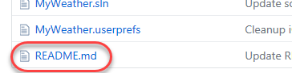

1. Click the **Edit** button to enter edit mode.

    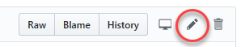

1. Make a minor change to the file. It doesn't really matter what, as long as it's changed.

    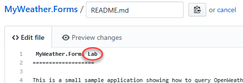

1. At the bottom of the page, click **Propose file change**.

    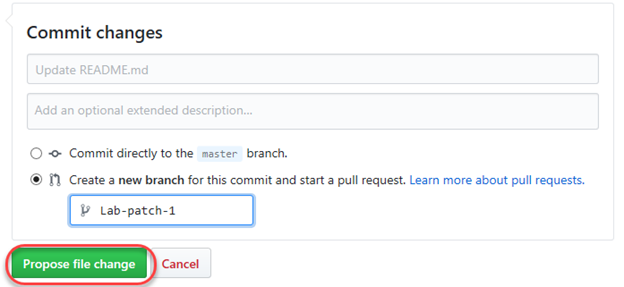

1. Click **Create pull request**.

    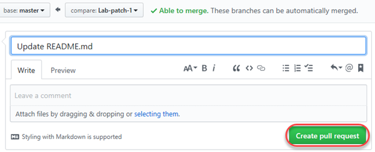

1. On the pull request page, you should see an option to set up continuous integration. Click the **are available** link to review the options.

    

1. Click the **App Center** option. If it's not visible, you can find it under **Continuous Integration | Mobile CI**.

    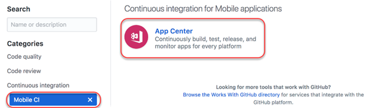

1. Take an opportunity to review the features and screenshots for App Center as you scroll through the page. At the bottom, select a pricing tier (**Free** is fine for this lab) and click **Install it for free**.

    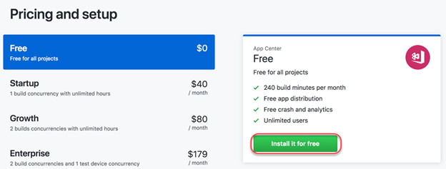

1. Review your order and click **Complete order and begin installation**.

    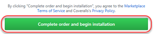

1. Review the permission requirements and authorize access to your data in GitHub.

1. If prompted, select an account to install App Center within.

1. Check **Only select repositories** and select the **MyWeather.Forms** repository you forked earlier. Click **Install**.

    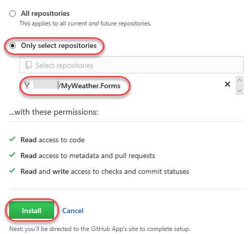

<a name="Ex1Task2"></a>
### Task 2: Configuring your app in App Center ###

1. You are now on the App Center site. If you need to create a new account, follow the instructions provided.

1. Now you can create and configure App Center apps for managing builds, tests, releases, and more. Select the **MyWeather.Forms** repository to create a new app.

    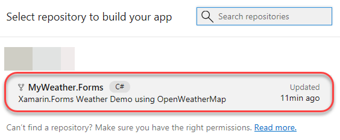

1. The form is prepopulated with the metadata pulled in from your GitHub project. It even knows what operating systems and platforms you're targeting. We're going to focus on Android to keep things simple for this lab, so uncheck **iOS** and click **Add**.

    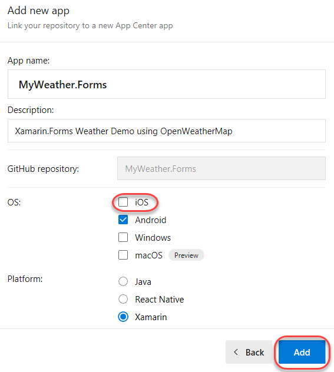

1. The first thing you can configure is when and how your app is built. Leave the defaults, which will build the Android project every time changes are pushed.

    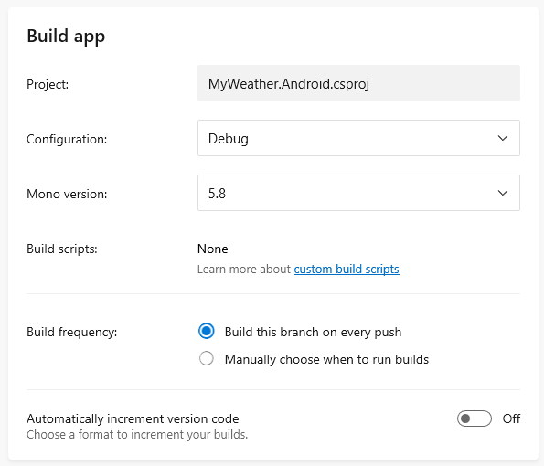

1. Next, you have more options to describe how the builds are configured, signed, tested, and distributed. If you'd like to learn more about the signing process, which enables build distribution, please see [https://docs.microsoft.com/en-us/xamarin/android/deploy-test/signing/?tabs=vswin](https://docs.microsoft.com/en-us/xamarin/android/deploy-test/signing/?tabs=vswin). Click **Save & Build** to continue. You don't need to wait for the build to complete to move on to the next step.

    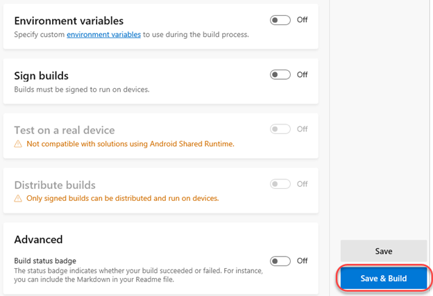

<a name="Ex1Task3"></a>
### Task 3: Integrating your app with App Center ###

1. Return to the GitHub tab in your browser. Click **Code** to view the repository code.

    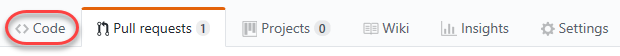

1. From the **Clone or download** dropdown, select **Open in Visual Studio**.

    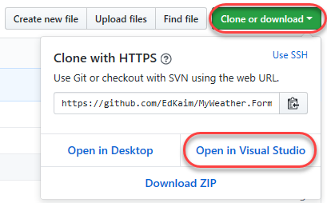

1. In **Visual Studio's Team Explorer**, click **Clone**. This will pull down a copy of the Git repository to your local machine.

    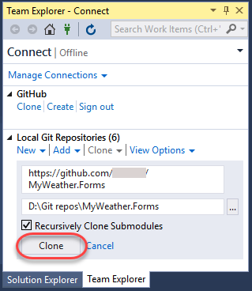

1. Once the clone has completed, open **Solution Explorer** and double-click **MyWeather.sln** to open the solution.

    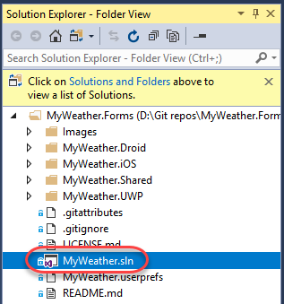

1. If asked to install or update SDKs for Windows or iOS, you can decline. This lab is focused on the Android project to keep things simple. In fact, let's remove the other platforms from our solution.

1. In **Solution Explorer**, right-click **MyWeather.iOS** and select **Remove** to remove it from the solution. Repeat the process to remove **MyWeather.UWP**.

    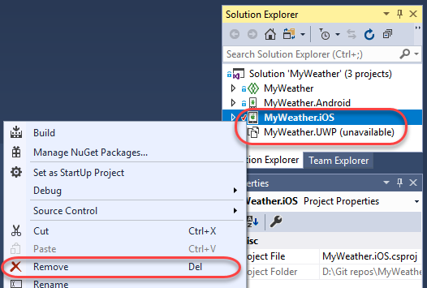

1. Next, we'll need to update the project configuration to ensure it works with the locally installed Android SDK. Right-click **MyWeather.Android** and select **Properties**.

    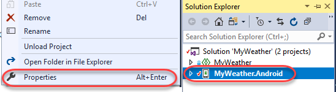

1. Update the **Compile using Android version** option to **Use Latest Platform**.

    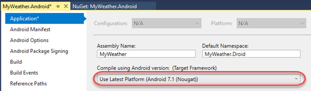

1. Now we can start bringing in the App Center SDK bits. They're provided as NuGet packages to make them easy to install and maintain. In **Solution Explorer**, right-click **MyWeather.Android** and select **Manage NuGet Packages**.

    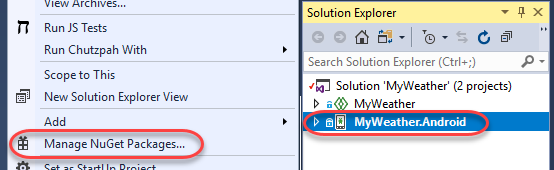

1. On the **Browse** tab, search for **"app center"**.

    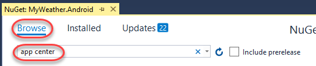

1. Select **Microsoft.AppCenter.Crashes** and click **Install**. Accept any licenses.

    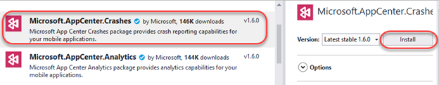

1. Repeat the process to install **Microsoft.AppCenter.Analytics**.

1. From the Android project, open **MainActivity.cs**. This is where the App Center SDK configuration will go. Configuration is done per-platform, so check the documentation when working with others.

    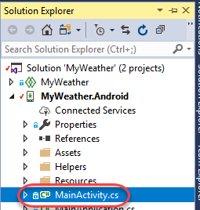

1. At the top of the file, add the following **using** references. This allows easy access to the classes in the NuGet packages we just added.

    ```c#
    using Microsoft.AppCenter;
    using Microsoft.AppCenter.Analytics;
    using Microsoft.AppCenter.Crashes;
    ```
1. Return to the App Center browser tab and locate the **Start the SDK** step. Copy the **AppCenter.Start** line of code (it may be across multiple lines). This code contains your app's unique ID so that you can start tracking analytics, events, and crashes.

    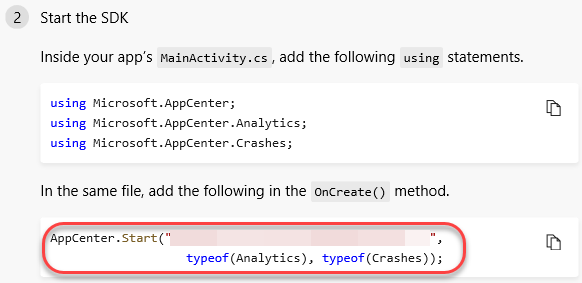

1. In **Visual Studio**, paste the code at the beginning of the **OnCreate** method in the **MainActivity** class opened earlier.

    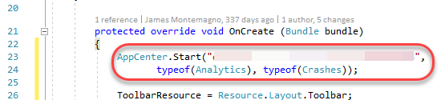

1. In **Solution Explorer**, open **WeatherViewModel.cs** from the shared **MyWeather** project.

    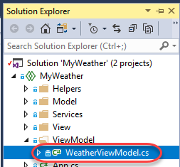

1. Add the line of code below in the **ExecuteGetWeatherCommand** method, right after the **IsBusy** check. This line of code logs this message to App Center every time the user requests the weather.

    ```c#
    Microsoft.AppCenter.Analytics.Analytics.TrackEvent($"Get weather requested");
    ```
    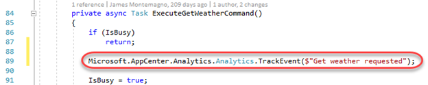

1. Enter the following code after the previously added line. This is a manufactured bug we're introducing to force an application crash in order to demonstrate how they're tracked. It will be invoked when the user searches for weather with a blank location.

    ```c#
    if (string.IsNullOrWhiteSpace(Location))
    {
        throw new Exception("Location crash bug!");
    }
    ```
    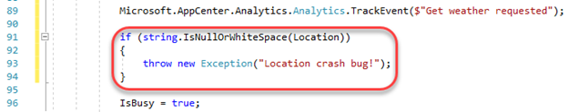

1. Finally, locate the **try/catch** block further down in the same method. Insert the code below within the **catch** block so that the caught exception may be logged to App Center. Note that you could simply provide the exception as the lone parameter, but we're using a more advanced overload that allows us to track a dictionary of metadata relevant to the crash. You'll be happy to have this extra detail when troubleshooting issues down the road.

    ```c#
    Microsoft.AppCenter.Crashes.Crashes.TrackError(ex,
        new System.Collections.Generic.Dictionary<string, string>
        {
            { "Location", Location.Trim() },
            { "UseGPS", UseGPS.ToString() },
            { "Issue", "Unable to get weather" }
        });
    ```
    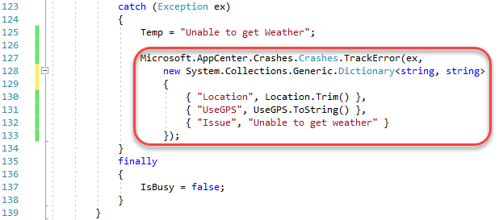

<a name="Ex1Task4"></a>
### Task 4: Testing your App Center integration ###

1. Now that we've configured the SDK, it's time to test it out. Select **Debug | Start Without Debugging**. If warned about performance issues with the emulator based on your current configuration, click **Start Anyway**. It may take a while for the emulator to launch the app the first time.

1. Update the search string to **"Seattle"**. Click **Get Weather**. This will invoke the code that tracks the event we wired up earlier.

    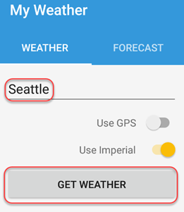

1. Now change the search string to **"Seattle123"** and click **Get Weather**. This will result in a caught exception and log the error with the dictionary data we supplied earlier.

    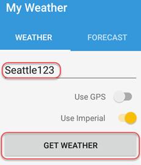

1. Finally, clear out the search box. Click **Get Weather** to invoke the unhandled exception we added earlier.

    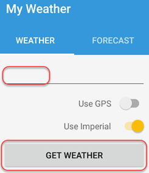

1. Since this exception is completely unhandled, it will crash the app. Fortunately, that data is captured and sent to App Center for you to diagnose later.

    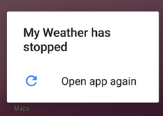

1. We can now check in on the data collected in App Center. Return to the App Center browser tab and click the **Analytics** tab.

    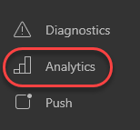

1. You should now see the first user has been tracked.

    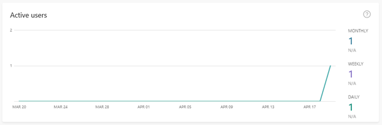

1. Click **Events** to view the data on events we recorded.

    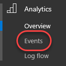

1. You should now see the first event raised from the app. You have the option to dig further into this event to see how many users were impacted, how often they were impacted, and so on.

    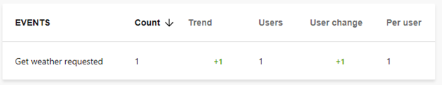

1. Click **Diagnostics | Errors**.

    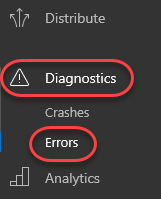

1. When we tried to search for "Seattle123", it resulted in an HTTP error. Click the error **404 (Not Found)** to drill into its details.

    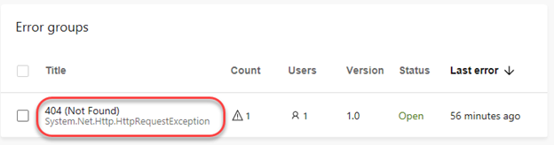

1. The overview tab provides details about the affected users, devices, and operating systems. Click **Reports** to see specific error reports.

    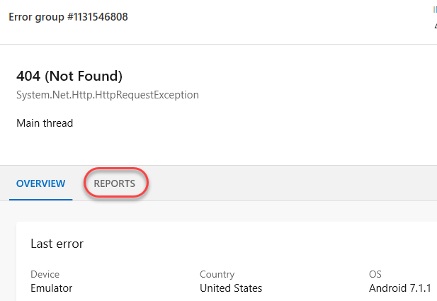

1. Click the first report in the list, which occurred on the emulator.

    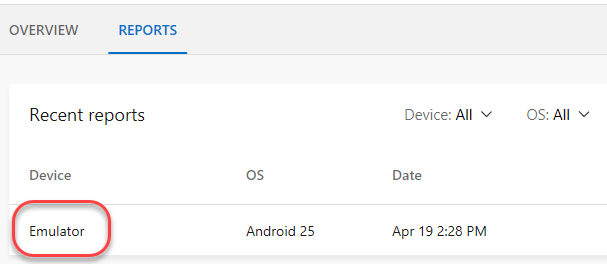

1. This error report includes a wealth of diagnostic data, including the stack trace and the metadata we supplied, such as the user input.

    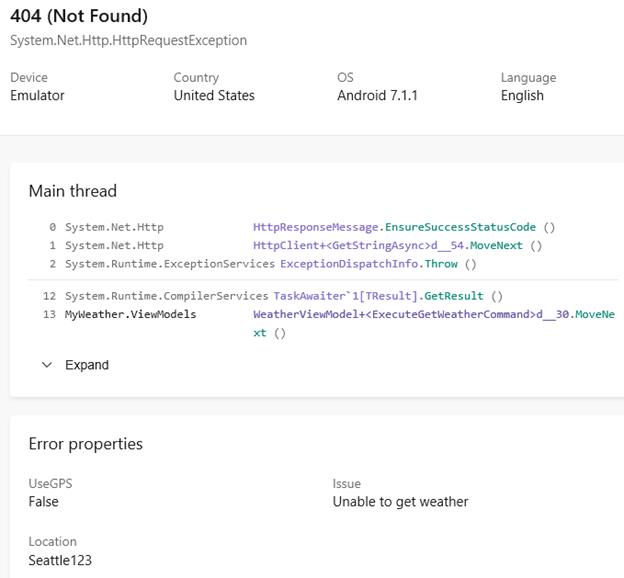

1. In the App Center tab, click **Crashes** under **Diagnostics** so we can review the unhandled exception crash.

    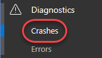

1. Crashes due to the same cause are grouped together for easy organization. If you click through, you'll get the same user experience you get from the error reporting.

    

<a name="Ex1Task5"></a>
### Task 5: Invoking a CI/CD build on App Center ###

1. Now that we're happy with our local changes, it's time to push the new app out to our users. With the continuous integration/continuous delivery support of App Center, we can begin the entire workflow by simply pushing our changes out.

1. However, we need to do a little housekeeping before we can commit the changes. In Visual Studio, select **File | Open | File**.

1. Navigate to the root of the project directory and select **.gitignore**. Click **Open**.

    

1. Add the following line at the top of the file to instruct Git to ignore the **.vs** folder in the root of the project and save it.

    ```
    /.vs/
    ```
    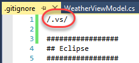

1. In **Team Explorer**, click **Changes**.

    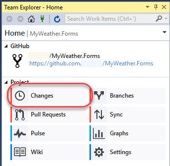

1. Enter the comment "**Lab commit"** and select **Commit All and Sync** from the **Commit All** dropdown. We're going to push this out directly to the **master** branch to keep things simple.

    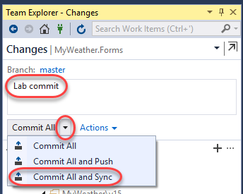

1. Return to the App Center tab and click **Build**.

    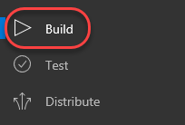

1. Follow the newly invoked **master** branch build as it reaches completion. Note that it was triggered by the push to the GitHub repository and includes our commit message. Click the **master** branch after it's done.

    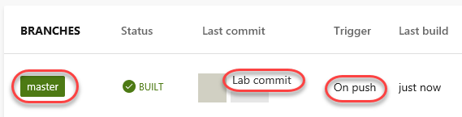

1. Select the first build from the list.

    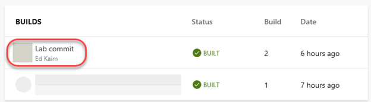

1. On this page you can review all of the details about this build, including the output and logs. If you configured build signing, you'll also have the option to distribute this build to your specified users.

    

1. If your build was signed, you can also install the **App Center Tester App** in order to download and run the latest version. Learn more about this at [https://blogs.msdn.microsoft.com/vsappcenter/how-and-why-we-built-our-new-visual-studio-app-center-tester-apps-preview-now-available](https://blogs.msdn.microsoft.com/vsappcenter/how-and-why-we-built-our-new-visual-studio-app-center-tester-apps-preview-now-available).

1. You can also export your raw analytics data to Azure for use in other apps, such as if you wanted to merge these analytics with a larger Application Insights instance. You can learn more about this at [https://docs.microsoft.com/en-us/appcenter/analytics/export](https://docs.microsoft.com/en-us/appcenter/analytics/export).

<a name="Summary"></a>
## Summary ##

In this lab, you learned how to create and integrate with an App Center app.

